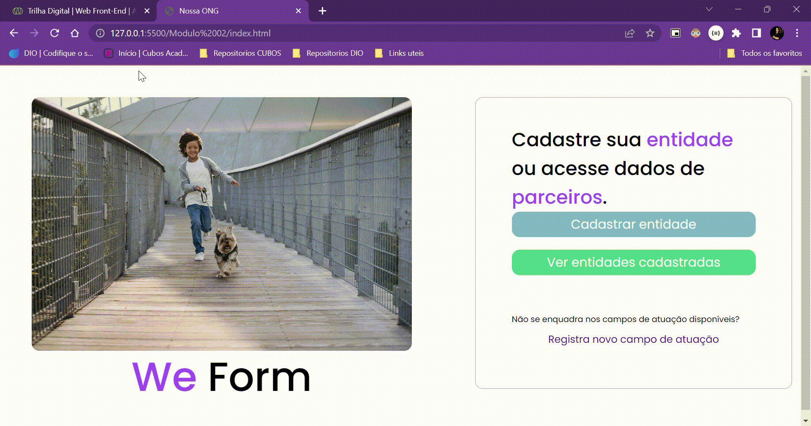

## Visão Geral

O projeto consiste em uma página web simples para uma Organização Não Governamental (ONG) chamada "Nossa ONG". A plataforma visa facilitar o cadastro de entidades e a visualização de parceiros. Utiliza HTML para estruturação, CSS para estilização e integra ícones da Font Awesome.

## Conteúdo do Repositório

- `index.html`: Página inicial da aplicação.
- `cadastro.html`: Página de cadastro de entidades.
- `styles.css`: Folha de estilo para estilizar as páginas.

## Funcionalidades Principais

- Cadastro de entidades.
- Visualização de entidades cadastradas.

