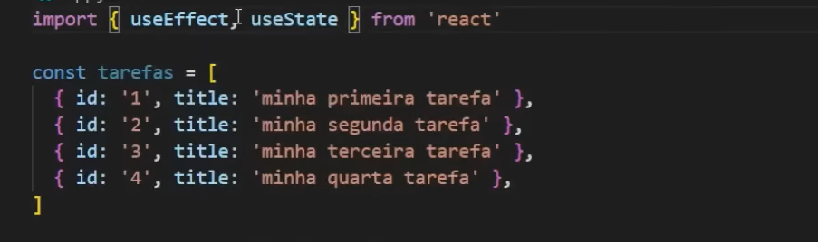
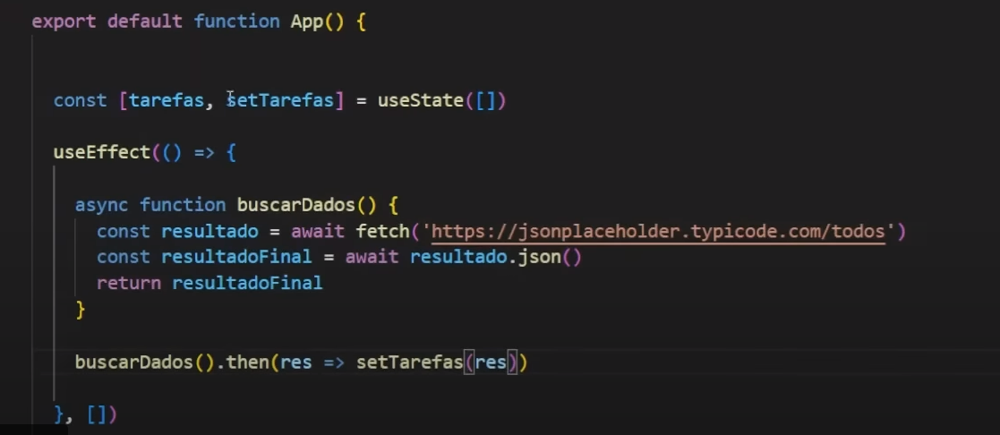
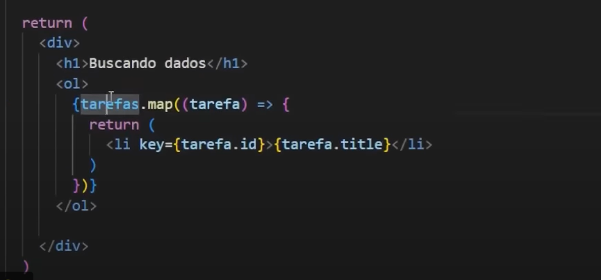

### Anotações impostante sobre as aulas - React

Comandos:
-> npm create vite
-> react
-> js

cd pasta_do_projeto
-> npm i 
-> npm run dev

### efeito colateral - ex: lista ou filtro de produtos 

temos uma lista, quero ter um input de texto que, quando eu escrever, só mostre ele na tela:

const minhaLista = [
    {id:'1', value: 'fruta'},
    {id:'2', value: 'pao'},
    {id:'3', value: 'cafe'}
]

const [pesquisa, setPesquisa] = useState('')

useEffect(
    () => {
        if(pesquisa) {
        const novaLista = minhaLista.filter((item) => {
            return item.value.toLowerCase().includes(pesquisa.toLowerCase)
        })
        setProdutos(novaLista)
    } else {
        setProdutos(minhaLista)
        }
    }
    [pesquisa])

const produtos = [produtos, setProdutos] = useState(minhaLista)
return (
   

     <h1>Efeitos colaterais</h1>
     <input
     value= {pesquisa}
     onChange={(e) => setPesquisa(e.target.value)}>
     </input>
        {minhaLista.map((item) => {
           return (
             

                <h4>{item.value}</h4>
             

            )
        })}
   

)

-> onChange - permite ouvir a mudança do valor do input

-> Criamos um efeito colateal com base numa variável de estado

### Buscando dados com fetch

### CSS

styles.css - aplica estilos globalmente, podendo causar conflitos e dificultar a manutenção em projetos maiores.
module.css - escopa estilos localmente para componentes, facilitando a organização, reutilização e evitando conflitos. A escolha depende do tamanho e necessidades do projeto. Comumente, ambos são usados em conjunto.